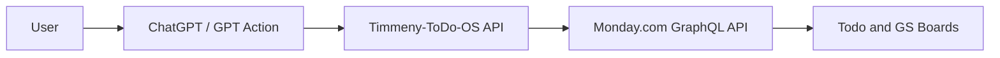
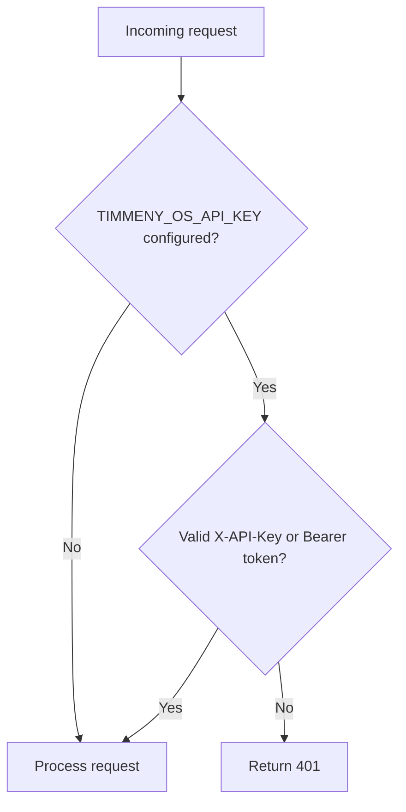
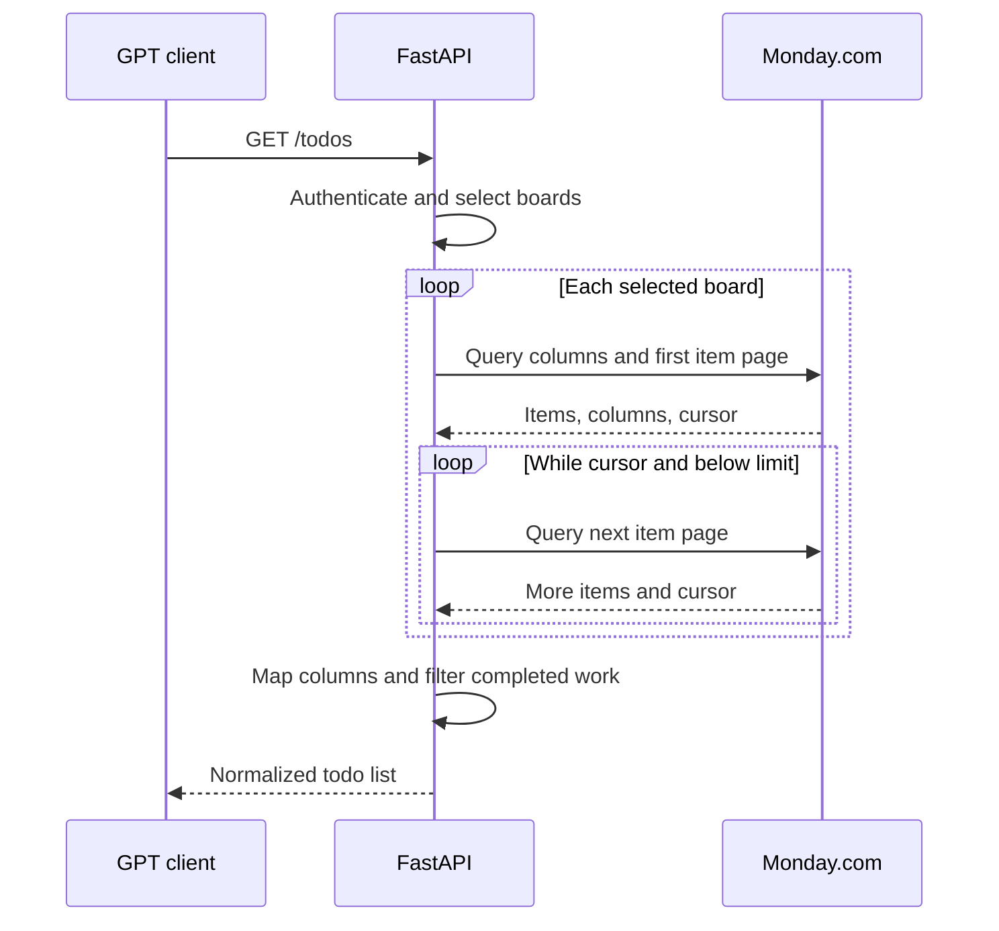
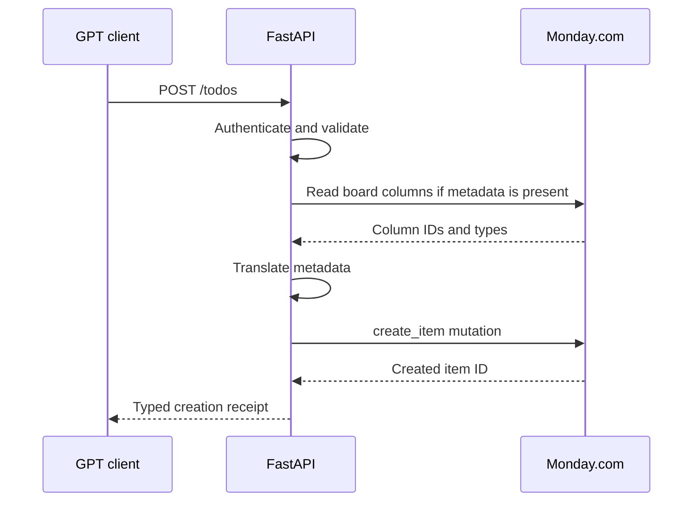
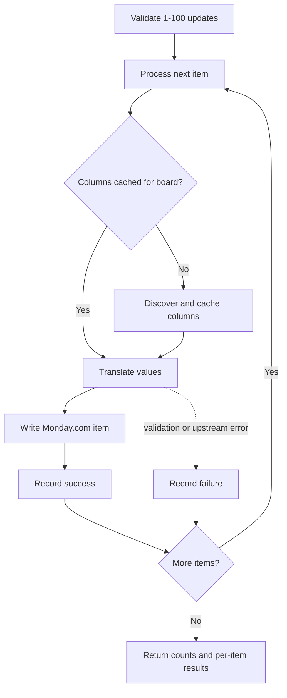
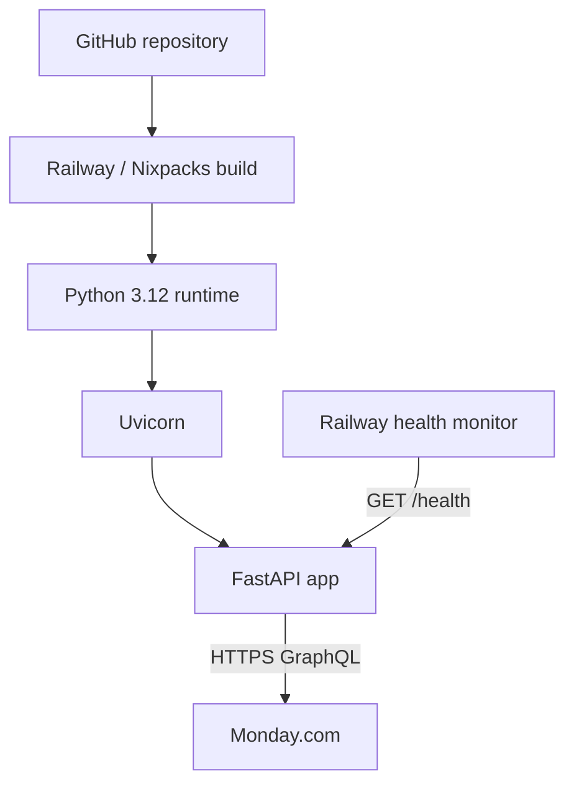

# Timmeny-ToDo-OS Architecture Overview

## Architecture Summary

Timmeny-ToDo-OS is a stateless FastAPI integration service deployed on Railway. It sits between conversational clients and Monday.com's GraphQL API. The client decides what the user is trying to accomplish; Timmeny-ToDo-OS provides a constrained, validated interface for reading and changing task data; Monday.com owns all persistent task state.



## Architectural Goals

The implementation reflects the repository's stated design biases:

- keep behavior legible and inspectable;
- make automated changes explicit;
- preserve human confirmation for broad writes at the assistant-workflow layer;
- keep Monday.com as the clear system of record;
- avoid infrastructure that is not yet required;
- use replaceable documents and interfaces for GPT behavior and knowledge.

## System Context

| Component | Responsibility | Owns persistent state? |
|---|---|---:|
| User | Provides goals, decisions, and confirmation | No |
| ChatGPT/custom GPT | Interprets natural language, reads context, proposes organization, and invokes actions | Conversation only |
| GPT instructions | Define safe GS planning and update behavior | Repository document |
| GS knowledge file | Supplies durable strategic and organizational context | Repository document |
| OpenAPI action schema | Defines the machine-readable GPT-to-API contract | Repository document |
| FastAPI service | Authenticates, validates, routes, translates, and reports results | No |
| Monday.com | Stores tasks, groups, columns, owners, statuses, and dates | Yes |
| Railway | Builds, runs, configures, logs, and health-checks the service | Operational metadata/logs |

## Runtime Components

### HTTP API Layer

`main.py` contains the FastAPI application and all current runtime behavior. Route functions:

- authenticate incoming requests;
- validate request data through Pydantic models;
- select the correct Monday.com board;
- call domain/helper functions;
- return typed response models.

The current API version is `0.4.1`.

### Request and Response Models

Pydantic models define the external contract for:

- task creation;
- task reads;
- planning metadata;
- single-item updates;
- bulk updates and per-item results;
- board metadata;
- Key Initiative items;
- health responses.

`StrEnum` types constrain task destinations to `todo` and `gs`, and read filters to `all`, `todo`, and `gs`.

### Board Routing

The service maps its logical lists to environment-configured Monday.com targets:

| Logical list | Board variable | Optional group variable |
|---|---|---|
| `todo` | `TODO_BOARD_ID` | `TODO_GROUP_ID` |
| `gs` | `GS_TODO_BOARD_ID` | `GS_TODO_GROUP_ID` |

The `GS_KEY_INITIATIVES_GROUP_ID` variable can identify the GS Key Initiatives group directly. If it is absent, the service matches the group title `Key Initiatives`.

### Monday.com Adapter

Monday.com integration is implemented as focused helper functions inside `main.py`. The adapter:

- sends GraphQL queries and mutations with `httpx`;
- reads boards, columns, groups, and items;
- follows Monday.com `items_page` cursors;
- attaches board-column titles to item column values;
- creates items;
- changes multiple column values on existing items;
- discovers column types and settings;
- serializes values into Monday.com's expected JSON representation;
- normalizes upstream errors into API errors.

### Metadata Translation

The public API uses stable semantic field names while Monday.com requires column IDs and type-specific JSON.

| API field | Monday.com column title | Translation |
|---|---|---|
| `annual_objective` | `Annual Objective` | String for text; label object for dropdown/status |
| `initiative_project` | `Initiative` | String for text; label object for dropdown/status |
| `action_group` | `Action Group` | String |
| `action_date` | `Action Date` | `{"date": "YYYY-MM-DD"}` |
| `action` | `Action` | Status label or dropdown labels |
| decision side effect | `Status` | `Not Yet Started` label |

The service discovers column IDs at runtime by exact column title. If a requested column is missing, the write fails explicitly instead of silently dropping data.

### Authentication

The API uses a server-configured shared secret:



The shared key protects the Timmeny-ToDo-OS API. `MONDAY_API_TOKEN` separately authenticates server-to-server calls to Monday.com and is never exposed through the public API schema.

### GPT Integration Documents

The runtime service is complemented by three versioned documents:

- `docs/gpt-action-openapi.yaml` defines the callable actions and schemas;
- `docs/gpt-instructions/gs-gpt-instructions.md` defines the GS assistant's operating workflow and confirmation policy;
- `docs/gpt-knowledge/gs-knowledge.md` provides durable GS planning context.

This separates three concerns:

1. what the service can do;
2. how the assistant should use it;
3. what durable business context should influence recommendations.

## Core Data Flows

### Read Open Tasks



When `list=all`, the configured limit applies independently to each board. The response count is the number of normalized items returned across the selected boards.

### Create a Task



If the request contains no planning metadata, the service skips the board-column lookup and creates the item directly.

### Bulk Metadata Update



Bulk updates are sequential within one request. This favors clear per-item results and controlled Monday.com access over maximum throughput.

## Data and State

### System of Record

Monday.com is the only task system of record. Timmeny-ToDo-OS does not use a database, file-backed task store, or cache.

### Stateless Service

Each request reconstructs the necessary context from:

- request data;
- environment configuration;
- live Monday.com board and column data.

This simplifies deployment and recovery, but means reads and metadata-aware writes depend on Monday.com availability and latency.

### Logs

Railway may retain request and response metadata in service logs. The application itself does not intentionally persist request bodies or task data.

## Configuration

| Variable | Required when | Purpose |
|---|---|---|
| `MONDAY_API_TOKEN` | Any Monday.com operation | Authenticates GraphQL requests |
| `TIMMENY_OS_API_KEY` | Optional | Enables client authentication when set |
| `TODO_BOARD_ID` | Accessing `todo` | Selects the general board |
| `TODO_GROUP_ID` | Optional | Selects the creation group on the general board |
| `GS_TODO_BOARD_ID` | Accessing `gs` or Key Initiatives | Selects the GS board |
| `GS_TODO_GROUP_ID` | Optional | Selects the creation group on the GS board |
| `GS_KEY_INITIATIVES_GROUP_ID` | Optional | Selects Key Initiatives by stable group ID |
| `PORT` | Set by hosting environment | Controls the Uvicorn listening port |

The Monday.com boards must use the expected column titles for requested planning operations. Column IDs may vary because they are resolved dynamically.

## Deployment Architecture



Railway starts the service with:

```text
uvicorn main:app --host 0.0.0.0 --port ${PORT:-8000}
```

There are no background processes, queues, schedulers, or worker services.

## Error and Resilience Model

The Monday.com client uses a 15-second timeout and maps failures as follows:

| Condition | API behavior |
|---|---|
| Monday.com timeout | HTTP 504 |
| Monday.com non-success HTTP response | HTTP 502 |
| Network/client error | HTTP 502 |
| Invalid Monday.com JSON | HTTP 502 |
| GraphQL `errors` returned | HTTP 502 with upstream error details |
| Missing board data, column data, or mutation result ID | HTTP 502 |
| Missing environment configuration | HTTP 500 |

There is currently no retry, circuit breaker, request deduplication, transaction, or rollback mechanism. Bulk operations can therefore partially succeed; the response preserves the result for each attempted item.

## Security and Privacy Characteristics

- All Monday.com credentials are supplied through environment variables.
- GPT/client requests never receive the Monday.com token.
- The public action schema uses HTTP bearer authentication.
- The runtime also accepts `X-API-Key`.
- Authentication is optional if `TIMMENY_OS_API_KEY` is absent, so production deployments should always configure it.
- The application does not define CORS policy, rate limiting, audit storage, secret rotation, user-specific authorization, or OAuth.
- Task contents transit ChatGPT, Railway, and Monday.com in the GPT Action workflow.

## Verification Strategy

The test suite uses FastAPI's test client and mocks outbound `httpx` calls. It verifies:

- the health contract;
- required environment configuration;
- authentication through both supported header styles;
- general and GS board routing;
- Monday.com item creation and upstream errors;
- metadata translation for text, date, dropdown, and status columns;
- automatic decision status;
- required-column enforcement;
- single and bulk updates;
- mixed-board batches and partial failures;
- multi-board reads;
- cursor pagination;
- default completed-item filtering and explicit inclusion;
- planning-context extraction;
- board label and observed-value discovery;
- Key Initiatives selection by title or configured group ID.

The tests are integration-boundary tests with Monday.com mocked; the repository does not currently contain a live end-to-end test against a real board.

## Repository Structure

| Path | Purpose |
|---|---|
| `main.py` | FastAPI application, models, routing, Monday.com adapter, and translation logic |
| `tests/` | API and integration-boundary tests |
| `docs/gpt-action-openapi.yaml` | GPT Action API contract |
| `docs/gpt-instructions/` | Assistant operating instructions |
| `docs/gpt-knowledge/` | Durable business and planning context |
| `docs/charter.md` | Product intent, scope, and design bias |
| `railway.json` | Railway build, start, and health-check configuration |
| `requirements*.txt` | Runtime and development dependencies |
| `runtime.txt` | Python runtime selection |
| `.env.example` | Environment configuration template |

## Current Architectural Constraints

- All runtime behavior lives in one module, which is simple but will become harder to evolve as integrations grow.
- Board schema is coupled to exact Monday.com column titles.
- Authentication is service-wide rather than per user or client.
- Bulk updates are non-transactional and sequential.
- There is no durable audit ledger beyond Monday.com state and hosting logs.
- GPT confirmation rules live in instructions rather than being enforced by the API.
- GPT instruction, knowledge, and OpenAPI files must be kept in sync manually with runtime behavior.
- The service depends directly on Monday.com's availability for every meaningful operation.

These are appropriate tradeoffs for the current focused scope. They become refactoring triggers if the product adds more users, integrations, workflows, write types, or automated background activity.

